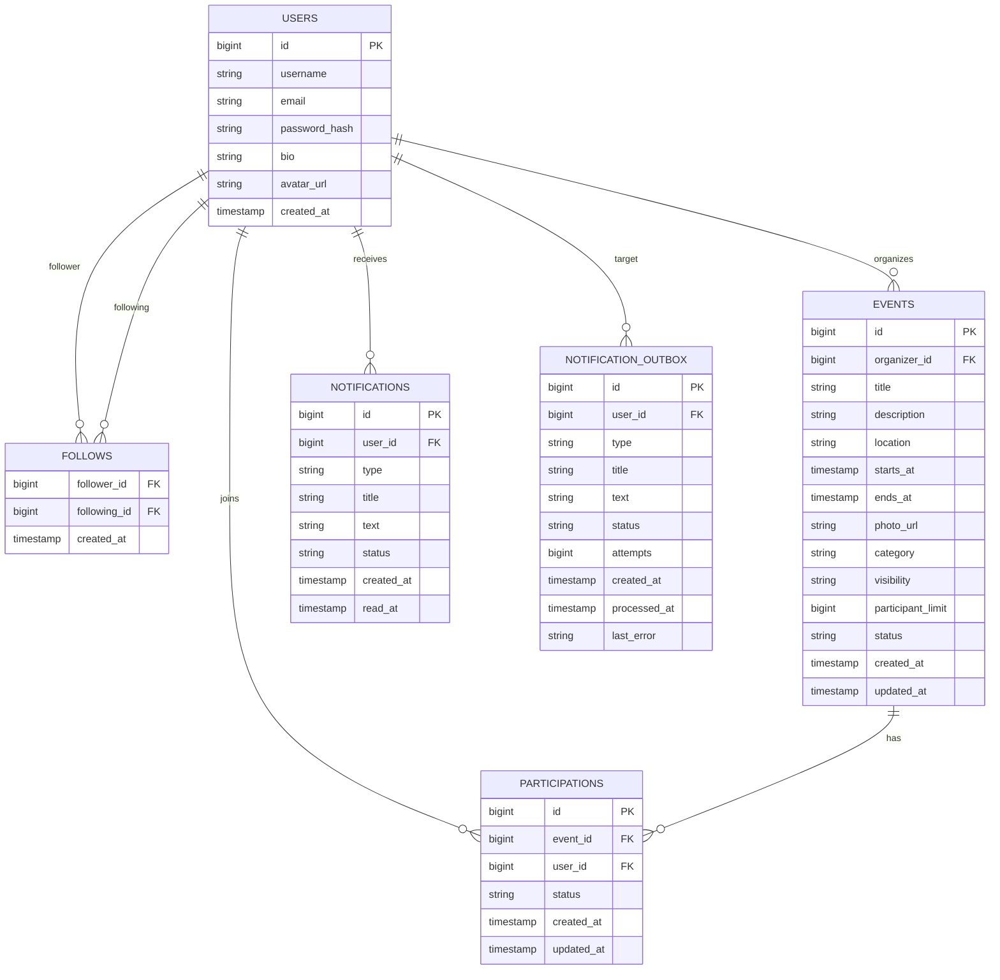

# ER-диаграмма

```mermaid
erDiagram
    USERS ||--o{ FOLLOWS : follower
    USERS ||--o{ FOLLOWS : following
    USERS ||--o{ EVENTS : organizes
    USERS ||--o{ PARTICIPATIONS : joins
    EVENTS ||--o{ PARTICIPATIONS : has
    USERS ||--o{ NOTIFICATIONS : receives
    USERS ||--o{ NOTIFICATION_OUTBOX : target

    USERS {
        bigint id PK
        string username
        string email
        string password_hash
        string bio
        string avatar_url
        timestamp created_at
    }

    EVENTS {
        bigint id PK
        bigint organizer_id FK
        string title
        string description
        string location
        timestamp starts_at
        timestamp ends_at
        string photo_url
        string category
        string visibility
        bigint participant_limit
        string status
        timestamp created_at
        timestamp updated_at
    }

    FOLLOWS {
        bigint follower_id FK
        bigint following_id FK
        timestamp created_at
    }

    PARTICIPATIONS {
        bigint id PK
        bigint event_id FK
        bigint user_id FK
        string status
        timestamp created_at
        timestamp updated_at
    }

    NOTIFICATIONS {
        bigint id PK
        bigint user_id FK
        string type
        string title
        string text
        string status
        timestamp created_at
        timestamp read_at
    }

    NOTIFICATION_OUTBOX {
        bigint id PK
        bigint user_id FK
        string type
        string title
        string text
        string status
        bigint attempts
        timestamp created_at
        timestamp processed_at
        string last_error
    }
```
