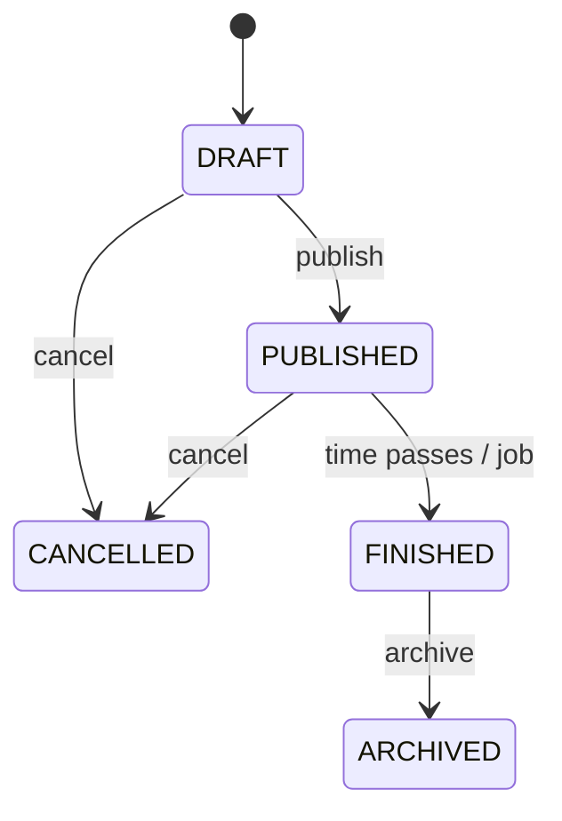

# Модель статусов события

## Правила

- События создаются в статусе `DRAFT`.
- Только организатор может публиковать, обновлять или отменять событие.
- Draft и published события можно обновлять.
- Публичные списки показывают только `PUBLISHED` события с visibility `PUBLIC`.
- `FINISHED` и `ARCHIVED` входят в целевую lifecycle-модель, но MVP пока не запускает scheduled status transitions.
