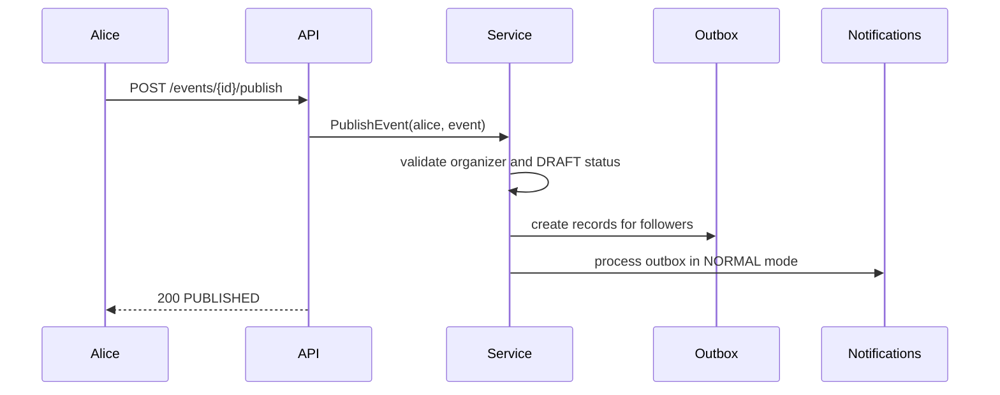
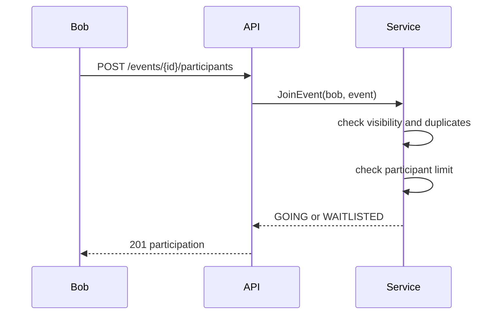
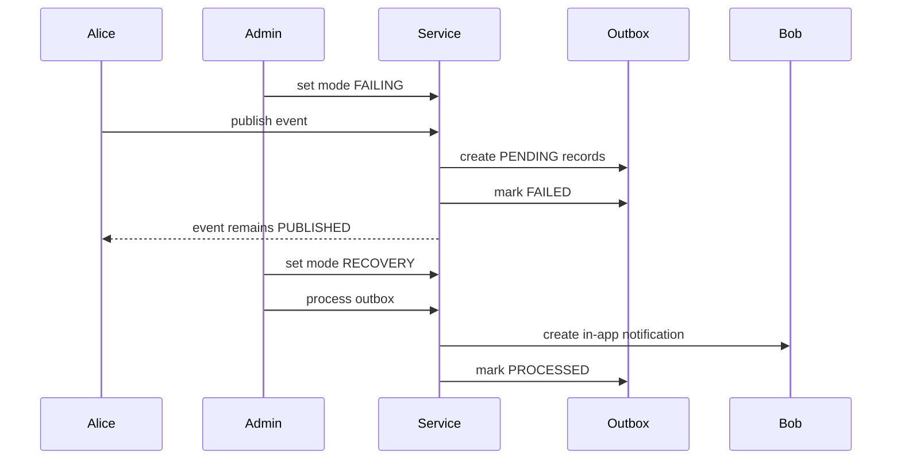

# Sequence diagrams

## Публикация события с созданием уведомлений

```mermaid
sequenceDiagram
    participant Alice
    participant API
    participant Service
    participant Outbox
    participant Notifications

    Alice->>API: POST /events/{id}/publish
    API->>Service: PublishEvent(alice, event)
    Service->>Service: validate organizer and DRAFT status
    Service->>Outbox: create records for followers
    Service->>Notifications: process outbox in NORMAL mode
    API-->>Alice: 200 PUBLISHED
```

## Присоединение к событию

```mermaid
sequenceDiagram
    participant Bob
    participant API
    participant Service

    Bob->>API: POST /events/{id}/participants
    API->>Service: JoinEvent(bob, event)
    Service->>Service: check visibility and duplicates
    Service->>Service: check participant limit
    Service-->>API: GOING or WAITLISTED
    API-->>Bob: 201 participation
```

## Отказ уведомлений и повторная обработка

```mermaid
sequenceDiagram
    participant Alice
    participant Admin
    participant Service
    participant Outbox
    participant Bob

    Admin->>Service: set mode FAILING
    Alice->>Service: publish event
    Service->>Outbox: create PENDING records
    Service->>Outbox: mark FAILED
    Service-->>Alice: event remains PUBLISHED
    Admin->>Service: set mode RECOVERY
    Admin->>Service: process outbox
    Service->>Bob: create in-app notification
    Service->>Outbox: mark PROCESSED
```
